<!--
SPDX-License-Identifier: GPL-3.0-or-later
Copyright 2026 Pete Heist
-->

# Capacity Sharing with Time Accumulation

Pete Heist 
Rodney Grimes 
August 31, 2026

## Abstract

CSTA (Capacity Sharing with Time Accumulation) provides bottleneck capacity
sharing using a shared time accumulator in the network.  With networks that
support CSTA, senders can safely increase their rate to the bottleneck's fair
share in as few as 2 RTTs, independent of capacity.  With a target capacity
below the maximum, queueing occurs only to absorb transient bursts.

## Introduction

A number of challenges persist in Internet congestion control, including:

- CCAs (congestion control algorithms) that do not scale well to modern
  bandwidths (capacities)
- CCAs that overreact to loss
- TCP slow start that can be slow to ramp to capacity, while often inflating the
  queue at exit
- CCAs that build queue by design, leading to large queueing delays when
  operating in oversized buffers
- lack of flow fairness between disparate CCAs and across RTTs
- congestion window growth without regard to the number of flows

Many of the above problems stem from the fact that the Internet was designed
with strict adherence to the end-to-end principle, with smart edges and a dumb
core.  This has good reasons, including scalability, simplicity, and flexibility
in the network, but it leaves endpoints to make hard performance tradeoffs.
Senders are left to probe for maximum capacity and discover their fair share,
and it can be difficult to distinguish between queueing and path delays.
Experiments with [ECN](https://www.rfc-editor.org/info/rfc3168/) and network
telemetry are starting to bend these rules.

While it's possible to design a system of explicit capacity reservations, where
flows are allocated, tracked and de-allocated in the network, it would be a
significant burden on the network to have to do so.  With CSTA, we use elapsed
time and a shared "time accumulator" as a way for flows to coordinate, along
with some basic network telemetry.  As such, flows can quickly determine their
target rate, and do not need to build a queue to do so.  The features of CSTA
are:

- Flows can quickly and safely set their rate to a requested portion of
  capacity, in as few as 2 RTTs.
- Flows compete fairly for capacity, independent of RTT.
- Multiple flows can start simultaneously, yet safely, with minimal impact on
  the queue.
- The utilized capacity at each hop can be kept somewhat below the maximum (see
  [capacity slack](#capacity-slack)), minimizing queueing delay.
- All traffic can coexist in a single queue, without flow awareness in the
  network, and with minimal computation ([security](#security) considerations
  aside).

## Scope and Limitations

CSTA is currently an experimental concept with no scope for deployment yet.
Idealized simulations have verified that the capacity sharing mechanism can
work, but not how well it would work in real world networks with
[jitter](#jitter), [loss](#loss), [multiple hops](#multiple-hops) and [high flow
churn](#high-flow-churn).  The use of a feedback variable from the network
raises questions about [security](#security).  Finally, no attention has yet
been given to coexistence with existing Internet traffic, or operation with
non-CSTA bottlenecks.  All of the above are potential topics for future R&D.

# Architecture

### The Timeulator

Coordination between flows occurs with the "timeulator", a shared counter at
each hop.  Senders pass increments to the timeulator in proportion to both
elapsed time and their allocated portion of fair share.  Flows allocating one
fair share increment the timeulator one to one with the rate of time.  Hops add
to their timeulator and pass the current value in the telemetry to return to the
sender.  In this way, capacity sharing is coordinated with a single 64-bit
counter, using elapsed time as a common reference.

Given:

* *Σ*: the timeulator, or time accumulator, a 64-bit counter in nanoseconds
* *Σinc*: a timeulator increment, also referred to as a timecrement
* *Pflow*: the portion of capacity allocated by a flow (> 0),
  where 1.0 is a fair share portion 1.
* *Pbottleneck*: the allocated portions of bottleneck capacity
* *C*: capacity allocated to CSTA traffic (bytes/sec) 2
* *Rflow*: target flow rate (bytes/sec)

1 Flows can technically allocate more than a fair share of capacity
by with *Pflow* > 1.0. This may be clamped to 1.0 at the sender to
prevent one flow from occupying more than fair share.

2 C can and should be somewhat lower than the bottleneck's maximum
capacity ([capacity slack](#capacity-slack)).

Senders pass Σinc to the network at regular intervals.  For maximum
precision, this can be with every packet. Σinc is calculated as
follows, where Δt is the elapsed time since Σinc was previously sent.

$Σ_\text{inc} = P_\text{flow} * Δt$

Senders can determine Pbottleneck for the period between any two
points in time as follows:

$P_\text{bottleneck} = ΔΣ / Δt$

With Pbottleneck available, senders know their allocated share of
capacity:

$R_\text{flow} = C * P_\text{flow} / P_\text{bottleneck}$

### Packet Fields

Following is not an exact or final packet format, but a list of the fields
required for input to and output from the network.

An 8-bit Hops Left field is required as both **input** and **output**.  It's set
to the hop count at the sender, and decremented by each hop. 3

Fields required as **input** to the network (listed in reverse order, so that
the Hops Left field is an index to a hop's input, if no path change occurred):

- 64-bit Hop ID - randomly generated by each hop 3
- 64-bit Σinc - [timeulator](#timeulator) increment

Fields required for **output** telemetry, appended by each hop, for reflection
back to the sender:

- 64-bit Hop ID (as in input fields)
- 64-bit *C* - capacity allocated to CSTA traffic (bytes/sec)
- 64-bit *Σ* - the [timeulator](#timeulator) (nanoseconds)
- 64-bit Total Sent Bytes (for CSTA traffic)

3 See also [Hop ID](#hop-id).

### Hop Requirements

Hops are required to:

- generate a 64-bit random Hop ID, once at initialization
- know their capacity (*C*), which may be advertised as somewhat less than the
  total capacity of the hop ([capacity slack](#capacity-slack))
- keep a local 64-bit [timeulator](#the-timeulator), updated as described below
- keep track of Total Sent Bytes for CSTA traffic, updated as described below

For each packet containing CSTA data:

1. Use Hops Left counter and/or Hop ID to locate Σinc for this
   hop.  If found, add Σinc the local timeulator (Σ).
2. Decrement Hops Left.
3. Add length of packet to Total Sent Bytes.
4. Append the 4 output fields from [Packet Fields](#packet-fields) to the output
   telemetry.

Optional behaviors are covered in the [Security](#security) section.

### Sender Requirements

Senders must:

- determine which hop is the bottleneck and what the target flow rate should be
- calculate a per-hop timeulator increment so the appropriate capacity is
  allocated for each hop on the path

The rate for each hop is:

$R_\text{hop} = C_\text{hop} * P_\text{flow} / P_\text{hop}$

Once the minimum rate is identified (Rbottleneck), this rate is used
to calculate a portion for each hop as follows:

$P_\text{flow-hop} = P_\text{hop} * R_\text{bottleneck} / C_\text{hop}$

Next, this per-hop portion is used to calculate a per-hop timeulator increment
per the formula for Σinc in [The Timeulator](#the-timeulator).  This
is passed for each hop as input to the network.

Senders can also allocate capacity for fixed-rate flows that stay within a given
requested fair-share portion.  The formula above for Pflow-hop is
used, with Rbottleneck replaced with the fixed rate.  If the
resulting P is greater than the fair-share portion limit (e.g. 1.0), then the
rate must be scaled down proportionally, and the sender will be aware of this
before having to suffer congestion to determine it.

Senders should also place a cap on their send rate based on the capacity and
utilization of the local interface.  In Linux, this is done with BQL and TCP
small queues.

### Receiver Requirements

The receiver must reflect the unmodified telemetry from any hops back to the
sender.  If the telemetry must be merged at any time, the lastest values from
each hop should be used.

### Capacity Slack

The available capacity is advertised in each hop's network telemetry.  By
allowing the capacity to be set in the network, it's configurable in one place
and makes it a matter of network policy.

Administrators may allocate all or part of a hop's capacity to CSTA.  Leaving
some capacity slack (available capacity) is highly recommended so that short
term bursts can be absorbed with little to no additional queueing.

Hops with variable bitrate link layers may configure the advertised capacity as
a fraction of the current maximum, which may change at any time (see
[Bottleneck Rate Changes](#bottleneck-rate-changes)).

## Simulations

In all simulations, the maximum allocated capacity is 90% of the bottleneck
capacity, leaving a [capacity slack](#capacity-slack) of 10%.

### Single Flow

Figures 1a and 1b show single flow tests with two very different RTTs and
bottleneck capacities (Figure 1a - 10 Mbps @ 20 ms RTT, Figure 1b - 100 Gbps @
600 ms RTT).  In both cases, the pacing rate is near capacity after two RTTs.

* **RTT 0**: Connection negotiation (SYN/SYN-ACK).  After negotiation we have
  the bottleneck capacity and baseline values for bottleneck sent bytes and
  timeulator, but we do not yet know the bottleneck rate, so it's not safe to
  start sending at capacity.
* **RTT 1:** One packet is sent with timeulator increment of Pflow *
  1 RTT, which would cause other flows (if present) to back off and yield
  requested portion of capacity.  After RTT 1, we have the first estimations of
  the bottleneck and timeulator rates.
* **RTT 2:** Enter the main control loop.  Increase rate by available capacity *
  Pflow / Pbottleneck.  With an empty bottleneck we can
  jump quickly to capacity.

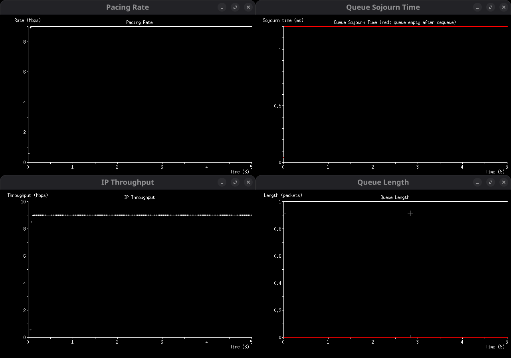

*Figure 1a: Single flow, 10 Mbps, 20 ms RTT*

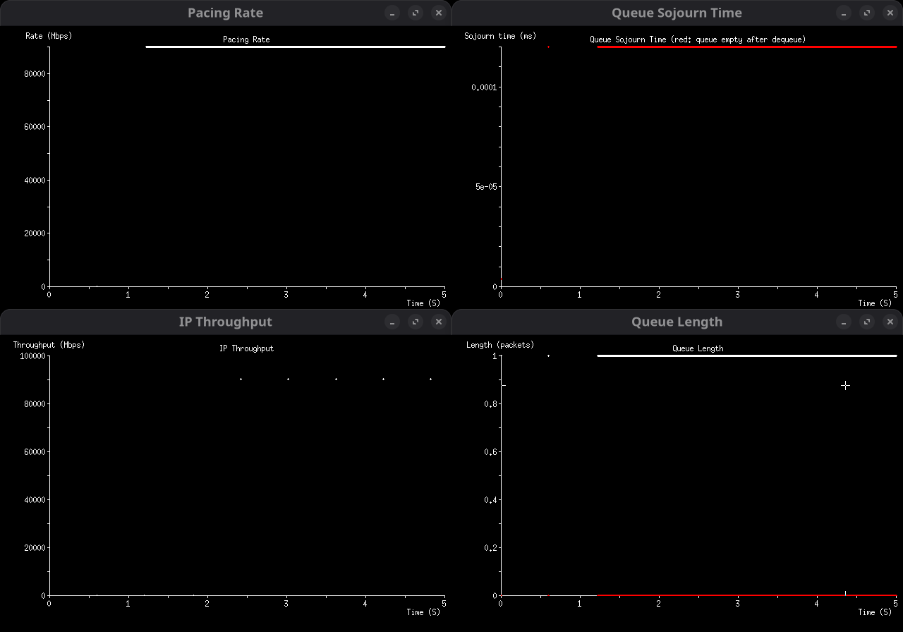

*Figure 1b: Single flow, 100 Gbps, 600 ms RTT*

### Two Flows

In Figure 2a we see two flows with different allocated portions.  One flow gets
a full fair share of 1.0, and the other a one-half share of 0.5.  The flows find
and maintain their rates of 600 Mbps and 300 Mbps.  In the IP Throughput plot,
the red trace is the total throughput.

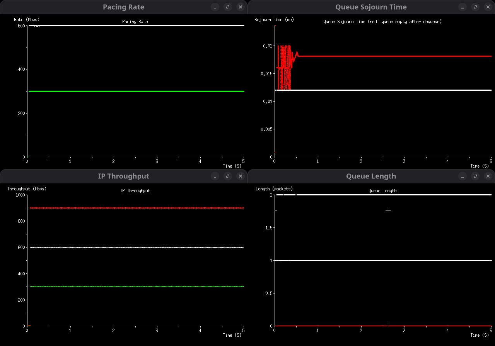

*Figure 2a: Two flows with portions 1.0 and 0.5, 1 Gbps, 20 ms RTT*

In Figure 2b we see two flows with different RTTs.  They have both requested a
fair share, so they compete fairly in the bottleneck, with 450 Mbps each.  The
queue length stays around 1-2 packets.

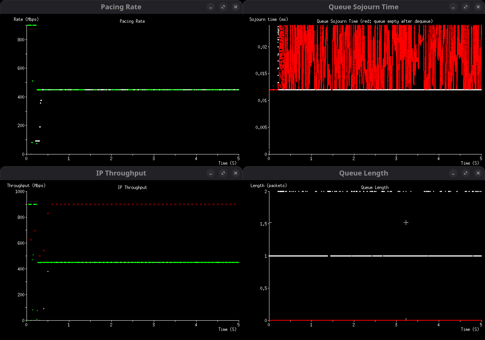

*Figure 2b: Two flows, 10 ms RTT vs 100 ms RTT, 1 Gbps*

### Multiple Flows

In Figure 3a, we see 16 flows started simultaneously.  Aside from a brief 0.2 ms
queue spike at flow start, the flows accurately find their pacing rates of 56.25
Mbps (900 / 16), and maintain a steady state of around 3-5 packets in the queue.

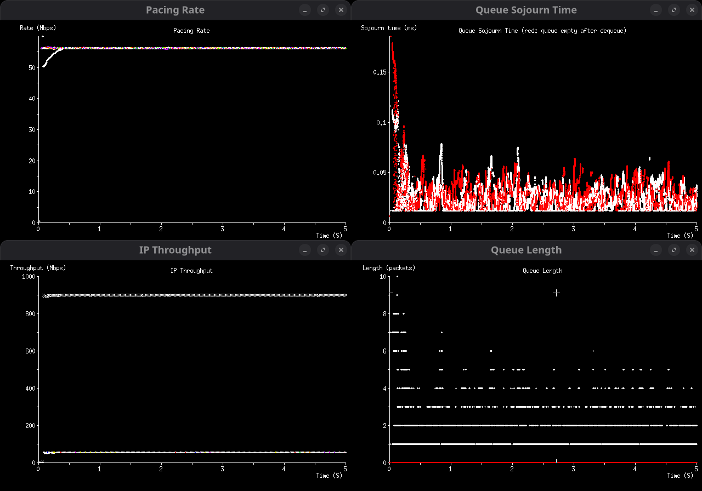

*Figure 3a: 16 flow simultaneous start, 1 Gbps, 20 ms RTT*

In Figure 3b, we see 1000 flows started simultaneously in a 10 Gbps bottleneck.
This causes a ~1 ms queue spike at flow start and a steady state of 3-4 packets
in the queue.

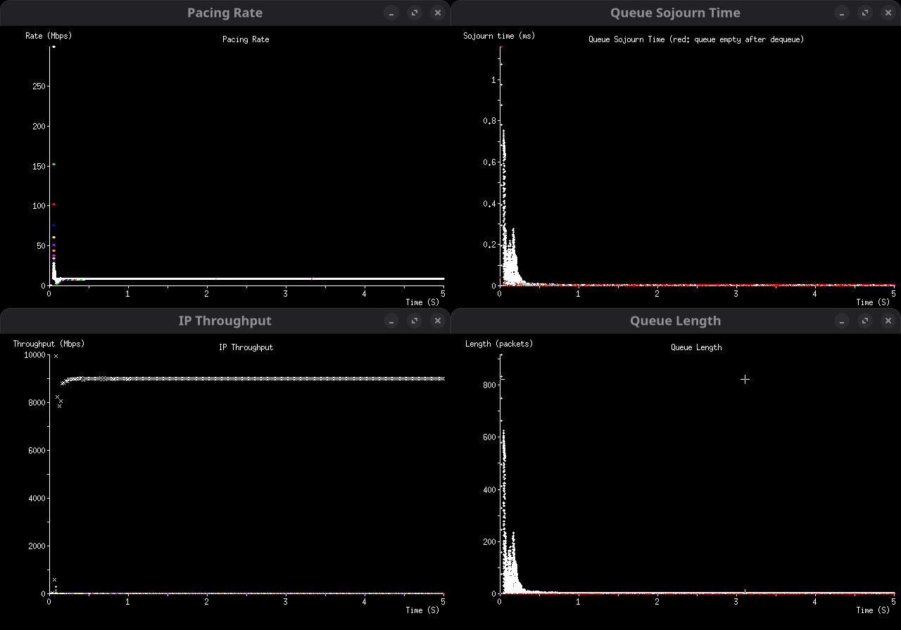

*Figure 3b: 1000 flow simultaneous start, 10 Gbps, 20 ms RTT*

For a more degenerate case, Figure 3c shows 1000 flows in a 100 Mbps bottleneck.
There is a larger spike of over 100 ms at flow start, and it takes ~15 seconds
for the rates to fully stabilize.  The reasons for this are not fully understood
yet, but in general, higher packet rates seem to result in more precise rate
control.

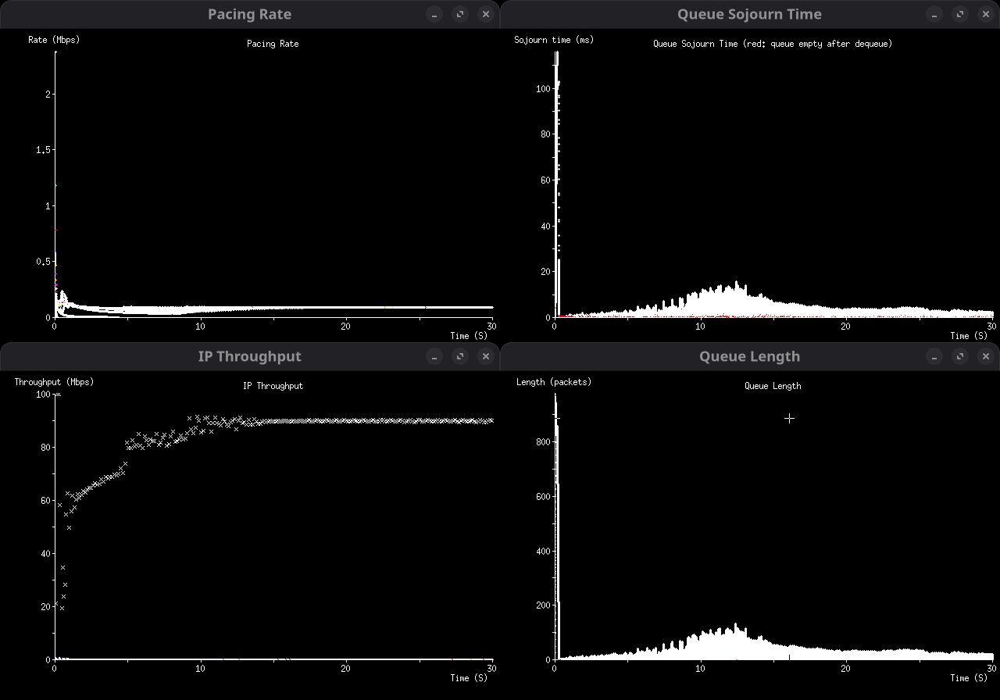

*Figure 3c: 1000 flow simultaneous start, 100 mbps, 20 ms RTT*

## Staggered Flows

In Figure 4a, we see a second flow active from T=5 to T=10 sec.  Figure 4b shows
a corresponding plot of the bottleneck's timeulator.  We see that the slope of
the timeulator value corresponds to the number of allocated portions (in this
case, flows, as they both have an equal, fair share portion).

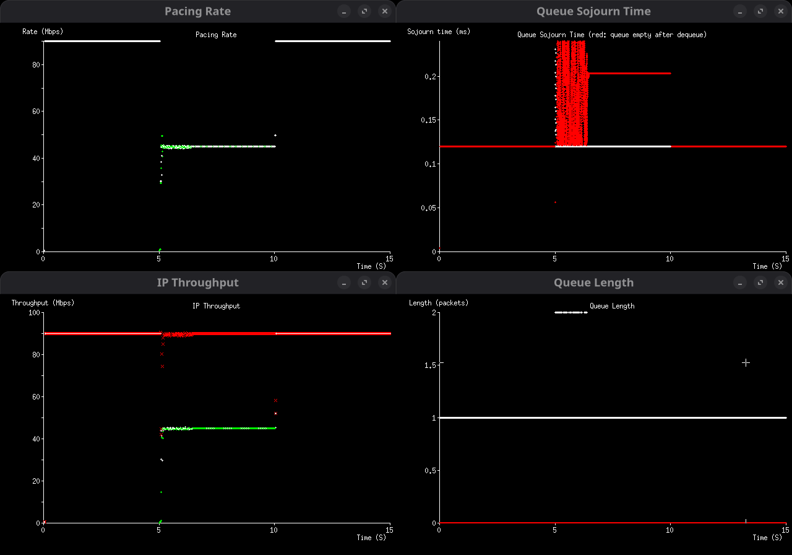

*Figure 4a: Two flow staggered start, 1000 mbps, 10 ms RTT*

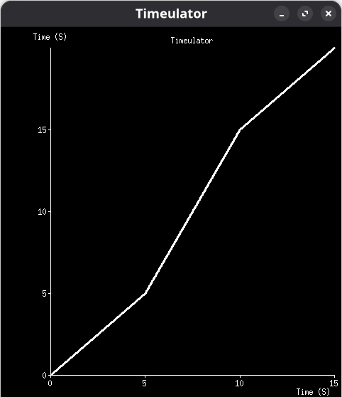

*Figure 4b: Two flow staggered start, Timeulator*

Figure 4c shows a flow at 600 ms RTT introduced at test start, then a 5 ms RTT
flow introduced at T=5 sec.  The newly introduced 5 ms RTT flow is unable to set
its rate to fair share until the 600 ms RTT flow becomes aware of it via the
timeulator and reduces its rate.  There is a 2 ms queue spike as the second flow
hits its rate which needs investigation.  

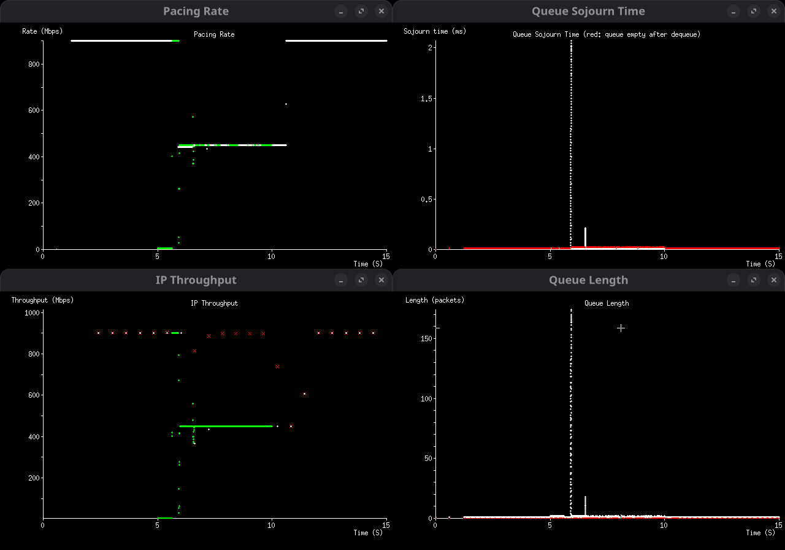

*Figure 4c: Two flow staggered start, 1000 mbps, 600 ms vs 5 ms RTT*

Figure 4d shows four staggered flows with varied portions and how their rates
interact.  As an example, from T=10 to T=15, 3 flows are active (flows 0-3), and
the ratio of their rates is 4:2:1, according to their portions.

| Flow | Color | Portion | Active  |
|------|-------|---------|---------|
| 0    | White | 1.0     | 0-30 s  |
| 1    | Green | 0.5     | 5-15 s  |
| 2    | Red   | 0.25    | 10-20 s |
| 3    | Blue  | 0.1     | 15-25 s |

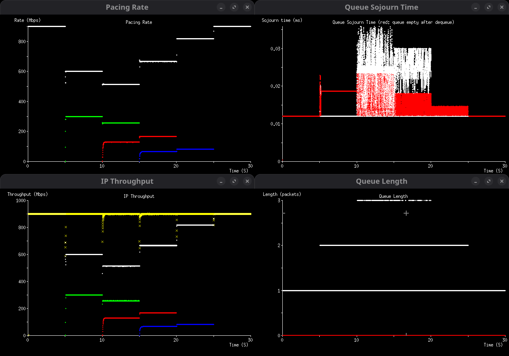

*Figure 4d: Four flow staggered start with varied portions, 1000 mbps, 10 ms RTT*

### Bottleneck Rate Changes

Figures 5a and 5b show two flows with portions 1.0 and 0.5, in a bottleneck with
maximum rates typical for WiFi 6 (802.11ax).  The rate is adjusted during the
test as follows:

| Time (sec) | Rate (% of full) |
|------------|------------------|
| 0          | 100%             |
| 5          | 90%              |
| 10         | 100%             |
| 15         | 50%              |
| 20         | 100%             |
| 25         | 20%              |
| 30         | 100%             |

The flows are quick to react to rate changes because they see the capacity
change in the bottleneck's telemetry.  While the queue spike at T=5 is not
visible as it's absorbed by the [capacity slack](#capacity-slack), the spikes
at T=15 and T=25 are due to data already in flight when the rate drop occurs.

Real world performance with WiFi would likely differ due to its bursty nature.

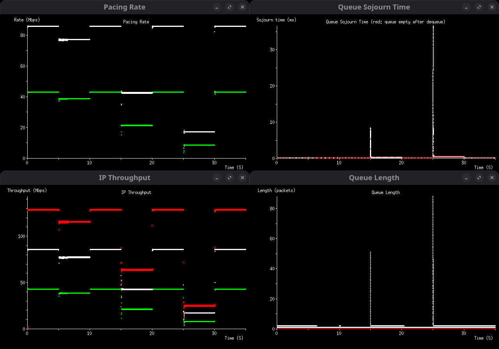

*Figure 5a: Two flows, 1.0/0.5, WiFi 6 approximation, 20 MHz channel, 143 Mbps, 10 ms RTT*

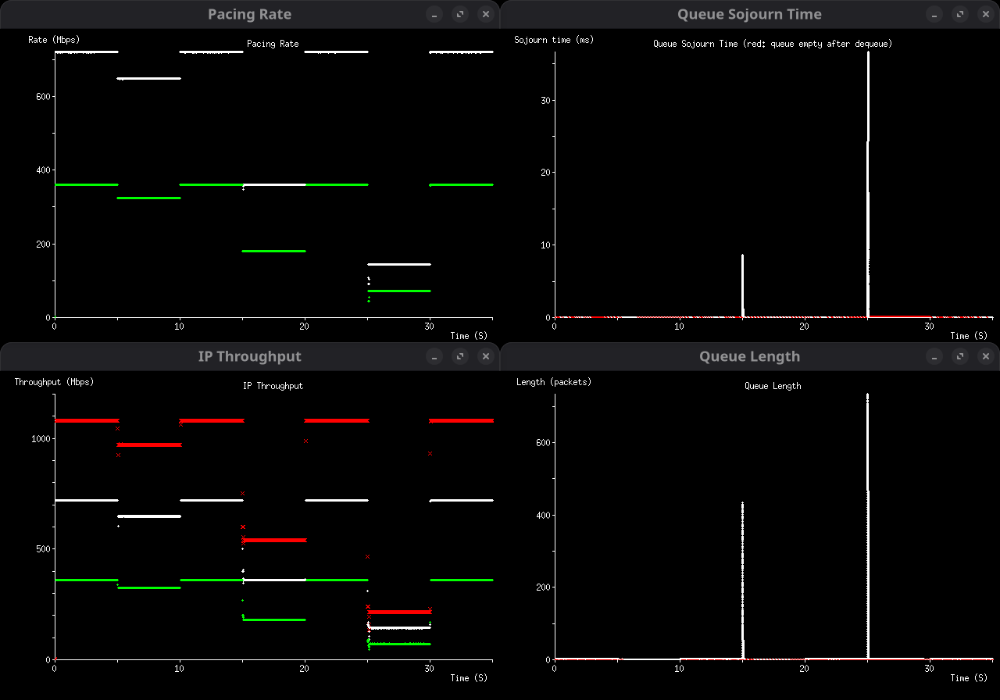

*Figure 5b: Two flows, 1.0/0.5, WiFi 6 approximation, 160 MHz channel, 1200 Mbps, 10 ms RTT*

### Fixed Rate Flows

Figure 6 shows a fixed rate 20 Mbps flow in competition with a fair-share flow.
The 100 Mbps bottleneck has a 50% rate drop at T=5 sec, and a 75% rate drop
(from the initial rate) at T=10 sec.  The rate of 20 Mbps is maintained until
the capacity and competing flows no longer allow it.  Between T=10 and T=15, the
available capacity of 22.5 Mbps ($100 Mbps * 0.9 * 0.25$) is shared equally
between the two flows.

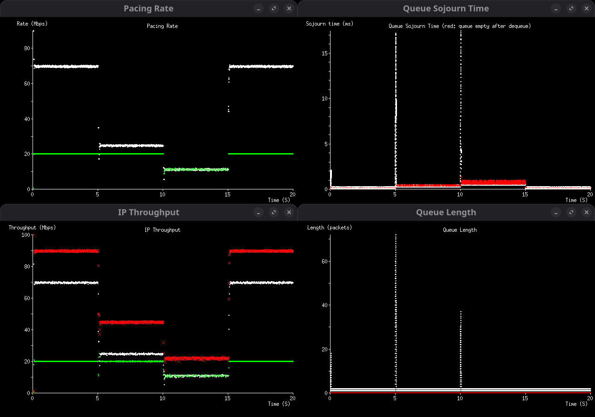

*Figure 6: Fixed rate 20 Mbps flow vs fair-share flow, 100 Mbps bottleneck with varying rate, 20 ms RTT*

### Precision vs Capacity

This section illustrates the general concept that higher rate bottlenecks have
the potential for lower sojourn times and more precise rate control, however it
also shows a problem with the current CSTA CCA.  In general, as the number of
flows goes up, the capacity goes down and the RTT goes down, we see queue
inflation, where the aggregate rate is greater than the target, and there are
periodic oscillations in the queue.  This needs further investigation.

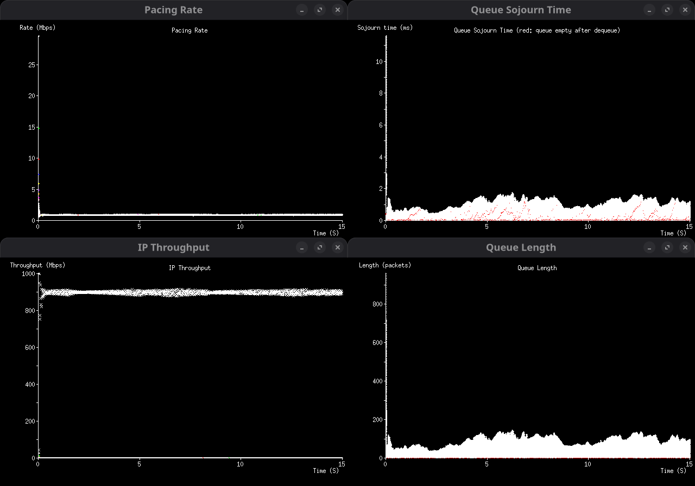

*Figure 7a: 1000 flows, 1 Gbps, 10 ms RTT*

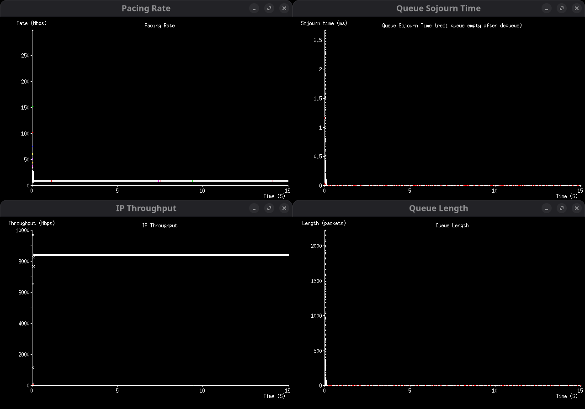

*Figure 7b: 1000 flows, 10 Gbps, 10 ms RTT*

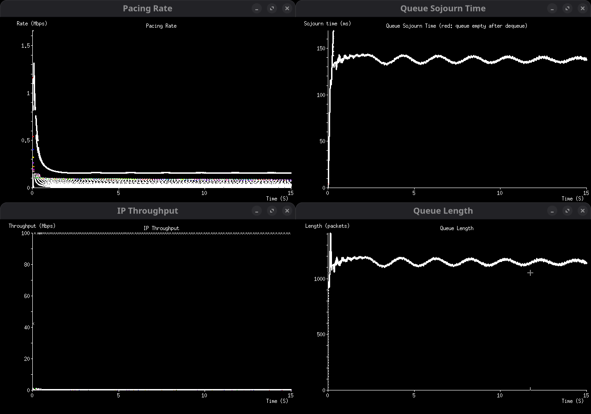

*Figure 7c: 1000 flows, 100 Mbps, 10 ms RTT*

## Discussion and Challenges

Topics in this section may require more research to resolve concretely.  They
are here for discussion, and to acknowledge that we're aware of them.

### Security

The [timeulator](#the-timeulator) exposes a way for malicious senders to force
other senders to reduce their rate by allocating capacity that it never uses.
While this is similar to unresponsive senders that can fill FIFO queues on
today's Internet, with CSTA, the attacker does not have to expend significant
resources to execute the attack.

One way to mitigate timeulator abuse is to segment traffic by "entities" where
appropriate, where an entity is any part of the network with sufficiently
aligned interests.  There is no incentive for an entity to harm itself.
Entities could be placed either in separate, scheduled queues, or in a single
queue by allocating each entity a portion of capacity, and dropping traffic sent
above that capacity.

Another way to mitigate abuse is to use flow awareness to determine if any flow
(where the definition could include e.g. L3 headers, or L3+L4) is either
incrementing the timeulator for capacity they're not using, or using more
capacity than they're allocating.  The math is fairly straightforward to
determine this, but it would be an extra burden on the network to have to track
and control each flow.

### Jitter

Network jitter will have an effect on the precision of the timeulator, and thus
each sender's estimation of the fair share of capacity.  This may be addressed
by smoothing timeulator samples at the sender at the expense of some delay, or
by running the control loop less often so there are more samples for calculating
the bottleneck portions and rate.  This will have to be explored in real world
networks.

### High Flow Churn

When there are many short flows starting and stopping in a bottleneck, high flow
churn will mean a variable timeulator rate, and thus calculation for the number
of bottleneck portions.  Short flow testing will be required in a realistic
network simulator to determine how CSTA CCAs handle this.

### Multiple Hops

Any hop which has no chance of becoming a bottleneck (it's overprovisioned) does
not need CSTA deployed.  However, there are cases where CSTA may need to be
deployed on multiple hops on a path.

In the [Architecture](#architecture) section, we propose handling multiple hops
by appending telemetry at each hop, and having the sender calculate and send
per-hop timeulator increments.  Ideally, telemetry from only one hop would be
needed, and each hop could overwrite that telemetry when it knew that it's the
bottleneck.  However, this would require both additional info from the sender
and more computation in the network, and that is why this approach was avoided.

### Non-CSTA Bottlenecks

The current CSTA architecture does not support having non-CSTA **bottlenecks**
in the network (non-CSTA hops are OK, see [Multiple Hops](#multiple-hops)).  The
problem is that if a hop with CSTA advertises a capacity that's higher than
another non-CSTA hop on the path, it will lead to congestion, and there's
currently no provision for handling that.  This may be addressed in the future.

### Non-CSTA Flows

Some flows may not need to make CSTA allocations (i.e. don't need to send
timeulator increments), such as low rate ICMP echo requests, or other low rate
control packets.  These can be absorbed by the [capacity slack](#capacity-slack).

It is not yet known how conventional capacity-seeking TCP flows will behave
together with CSTA traffic in a CSTA bottleneck.  In theory, they will behave
however TCP does when competing with rate-limited, unresponsive traffic.  More
research is needed on this.

### Loss

Packet loss is not explored in our current simulations, but we do not expect it
to cause a major challenge.  Loss can occur in one of two positions in the
network:

1.  If loss occurs **before a hop**, its timeulator increment is missed, so
    senders may slightly underestimate the number of bottleneck capacity
    portions, and thus slightly overestimate their send rate.  On the other
    hand, since the packet was lost before the hop, it has not contributed to
    the hop's utilized capacity, so not increasing the timeulator is
    appropriate.  Heavy loss on the forward path should result in a flow
    occupying less of the capacity than it requests, and other flows should
    correctly occupy that unused capacity.
2.  If loss occurs **after a hop**, either on the way to the receiver, or on the
    return path, the timeulator will be incremented and the hop capacity
    utilized, but affected senders will see a temporary delay in their
    timeulator increment.  Fortunately, the timeulator value is cumulative, so
    it will be corrected on the next update.  Heavy loss on the return path
    should merely result in a less precise estimation at the sender of the
    bottleneck portions, which is continually corrected over time.

Although both of these cases seem reasonable theoretically, they will need
testing in real world networks.

Since the requirement with CSTA is that all potential bottlenecks in the network
have CSTA support to control send rates, we see no reason for senders to reduce
their rate in response to packet loss.  This may change if support for non-CSTA
bottlenecks is added.

### Timer Precision

Endpoints require high precision timing to calculate timeulator increments and
measure the bottleneck portions.  The
[TSC](https://en.wikipedia.org/wiki/Time_Stamp_Counter) instruction has been in
most CPUs since 2008, but CSTA could be challenging to implement on older
devices.

High precision timing is not required in the **network**, unless the timeulator
needs to be monitored to implement additional [security](#security) features.

### Packet Inflation

Flows know their send rate, but not their actual rate seen by any given hop, as
their packets may have been inflated by encapsulated before they reached the
hop.  There are two alternatives for handling this:

1.  Add a Packet Length field to the output telemetry from the hop.  Senders can
    use this to reduce their send rate to compensate for the inflation.  This is
    under consideration.
2.  Allow the additional packet inflation to be absorbed by the
    [Capacity Slack](#capacity-slack).  The effectiveness of this is constrained
    by how much packet inflation occurs, and how much slack has been configured.

### Hop ID

CSTA needs some way to identify each hop so that the sender can send per-hop
timeulator increments.  Several options were considered:

1.  Hop IDs are positional indexes, with operation similar to the Segments
    Left field in [RFC8754](https://datatracker.ietf.org/doc/html/rfc8754), so
    that hops can access their input data directly.  This is performant, but by
    itselt is not resilient to path changes.
2.  Hop IDs are randomly generated values.  This is resilient to path changes,
    but requires each hop to search for its hop ID in each packet to get the
    input data it needs.
3.  A hybrid approach is used, where both a positional index and hop ID are
    included.  Hops first use the positional index to find their input
    telemetry, but they also verify that the hop ID for that position is
    correct.  If not, they search the other entries by hop ID.  That makes the
    lookup positional a vast majority of the time.

Option 3 was chosen for now, however this may change with experience and once
the deployment scope is known.  In controlled environments with
[SRv6](https://www.rfc-editor.org/info/rfc8986/), for example, positional
indexes alone may be sufficient.

### Control Loop Challenges

One challenge in simulation has been determining the right control loop interval
at the sender.  Too short, and the determination of bottleneck rate and portions
can be imprecise, resulting in poor rate control to the point of instability.
Too long, and the rate convergence time is unnecessarily delayed.  The current
implementatation does not work in all cases.  High RTT flows for example need
longer control loop intervals.

More work is needed on the control loop in general to determine what if anything
needs to be smoothed, and exactly how often it should run.  We envision a more
modular architecture with estimators for the bottleneck rate and portions, and
for the control loop to run when it has sufficient confidence in the
estimations.

### Low RTT Flows

In simulation, we see some effects at very low RTTs that need investigation.
Specifically, we have seen queue inflation, overutilization and flow domination
with flows in competition at an RTT of 20 μs.  In contrast we've seen
underutilization for very small RTT flows in competition with higher RTT flows,
e.g. 50 μs vs 20 ms.  Both issues need to be resolved along with a full review
of the control loop.

### Timeulator Oscillations

Fixed rate flows, as well we non-bottleneck capacity allocations, can introduce
small oscillations in the timeulator.  This is because in these cases, the
portion used to determine the timeulator increment is determined dynamically
rather than being fixed, and it adjusts according to conditions that the
adjustment affects.  The effect of this across multiple bottlenecks needs to be
investigated.  Appropriate smoothing of the calculated portion may be needed to
mitigate this.

### Initial Window

Unlike conventional TCP, CSTA can use an initial window (IW) of 1 packet and
still get reasonable short flow performance.  However, CSTA needs at least 2
RTTs to both send its initial timeulator increment, and estimate the
bottleneck's bitrate and timeulator rate (portions).  If it's crucial to send
data immediately in RTT 1, like IW, implementations may do so (and this **may**
be absorbed by any capacity slack), but it's safest to increase the rate only
after capacity becomes available.
